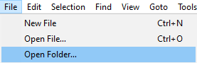
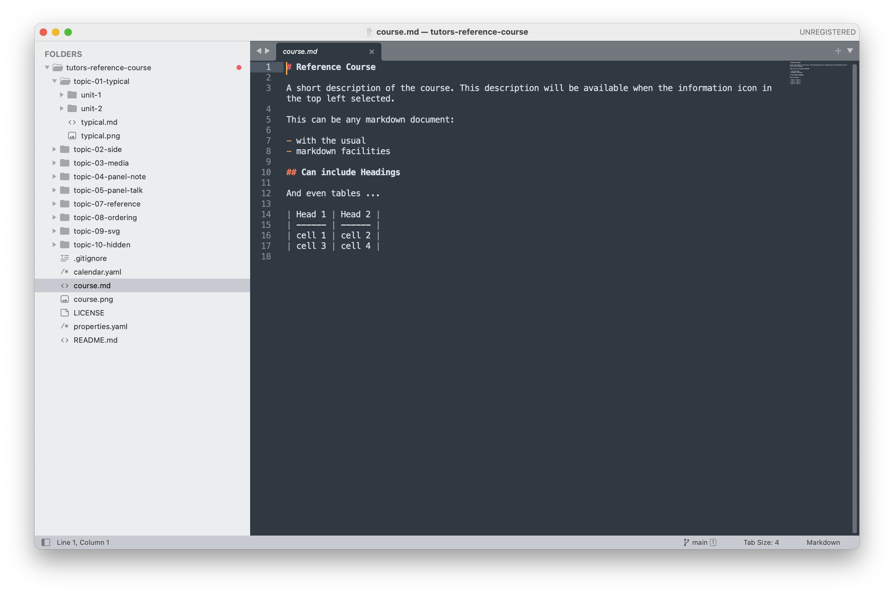
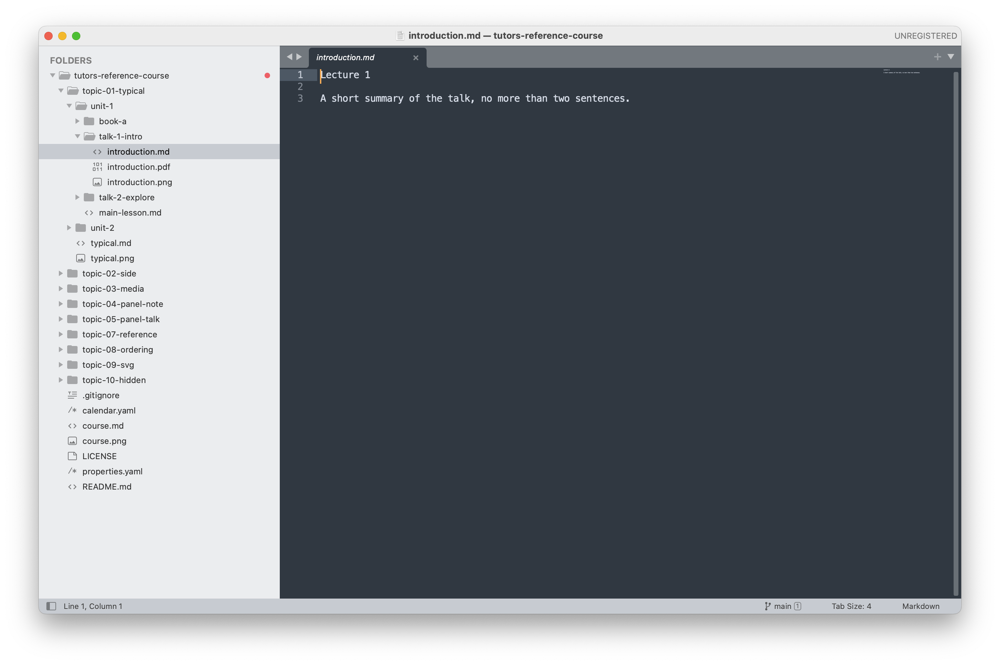

# Sublime

Sublime is a simple text editor which you can use to edit various course files. You can download the application here:

- [Sublime Download](https://www.sublimetext.com/)

Once installed, open the application. Then in Sublime, select `File` -> `Open Folder..`.

  

Navigate to the `tutors-starter` folder, then the `Select Folder` button. Note the sidebar which provides a convenient view of the file structure.

  

You can also just drag & drop the course folder from explorer (or Finder on Mac) directly onto an open Sublime window to open the folder as shown above.

You can select and edit most files from here. The main files of interest for the moment are:

- *.md : Markdown files
- *.yaml: YAML Files

Explore each folder and have a look at the various .md files:

Markdown is a simple notation for composing styled text. This is a 2-minute guide that is worth a quick look:

- <https://learnxinyminutes.com/docs/markdown/>