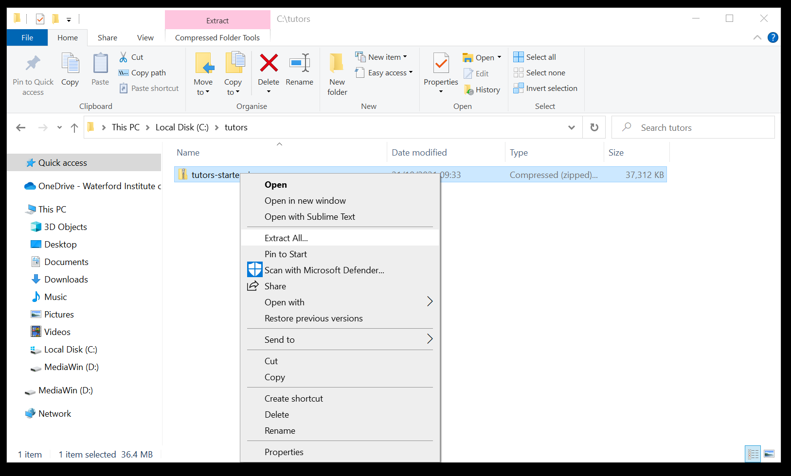

# Download the Tutors Course Template 

Download the following `.zip` file and save it to your preferred location on your workstation: 

- [Tutors Reference Course](archives/tutors-reference-course.zip)

Save this somewhere convenient - and keep note of where it is stored.

Extract the .zip file. How you do this will depend on which archiving tool you may have installed and which Operating Systems you use. On Windows it might look like this:

On a Mac, you typically just double-click on the archive to expand.

Once extracted, have a look at the layout of the contents of the folder:

This is a complete (sample) Tutors course. We will examine it in more detail later. This course is currently deployed here:

- [Tutors Reference Course](https://tutors.dev/course/reference-course)

Take a moment to explore the site. 

See if you can relate the web experience to the layout of the files in the folder on your workstation. Each card is clickable, and the various toolbars along the top have tooltips, visible when you hover.
