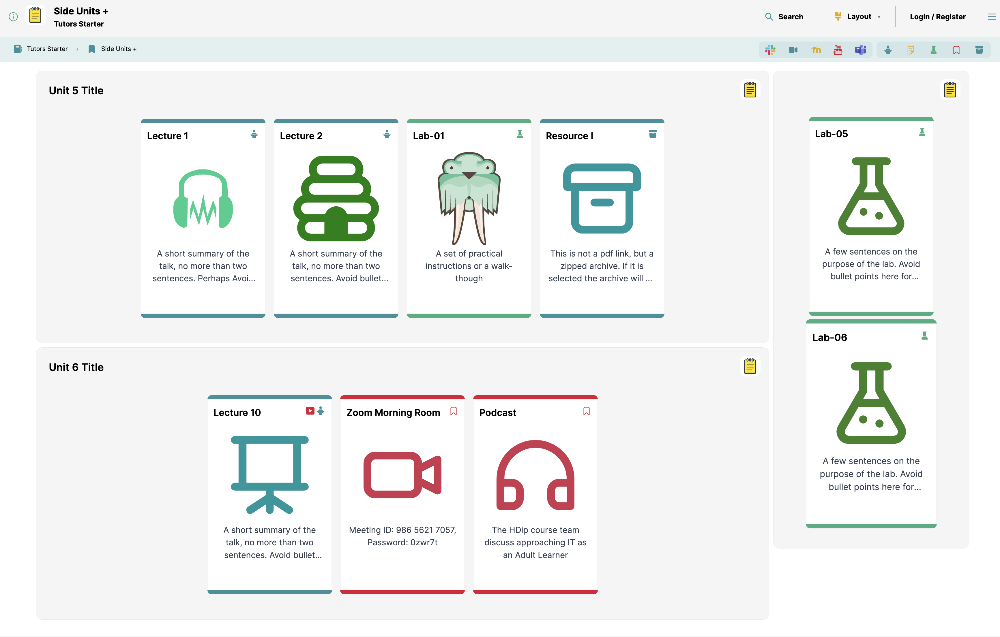

# Adding a lab

We are going to add another lab to our course. 

Open the the 'Side Units+' topic:

Now locate the side-unit folder in topic-03 in the course folder

Duplicate the book-b folder, calling it book-c, and redeploy the site:

See if you can figure out how to change the title to "Lab 07" as shown above? Also change the text shown in the card.

