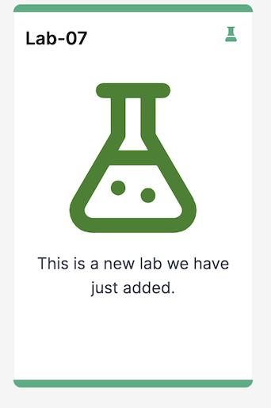
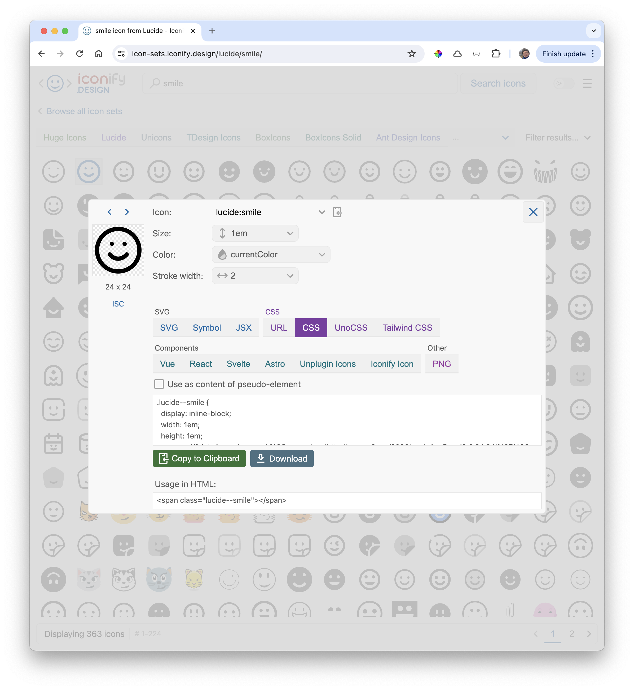

# Editing an icon

The new lab we have added:

Open the first file in the labs folder:

### topic-03/side-unit/book-03/00.Lab-07.md

~~~markdown
---
icon:
  type: uil:flask
  color: 398126
---   

# Objectives

This is a new lab we have just added.
~~~

Pay attention to the icon code at the top of the markdown file. The text enclosed in the `---` characters is called a front matter section, and we use it for various purposes. In this above, we are defining an icon for the card to be present in tutors.

We are going to change the icon type and colour. Navigate to [Iconify](https://icon-sets.iconify.design/.). This site has thousands of icons available to you. 

Look through the different icon sets and select an icon you would like to be displayed on the card. We can search by name for instance: 'smile':

Copy the code (the very top of the dialig), and include in the front matter of the markdown file:

~~~markdown
---
icon:
  type: lucide:smile
  color: blue
---   

# Objectives

This is a new lab we have just added.
~~~

Redeploy the course. You should see the new Icon:

