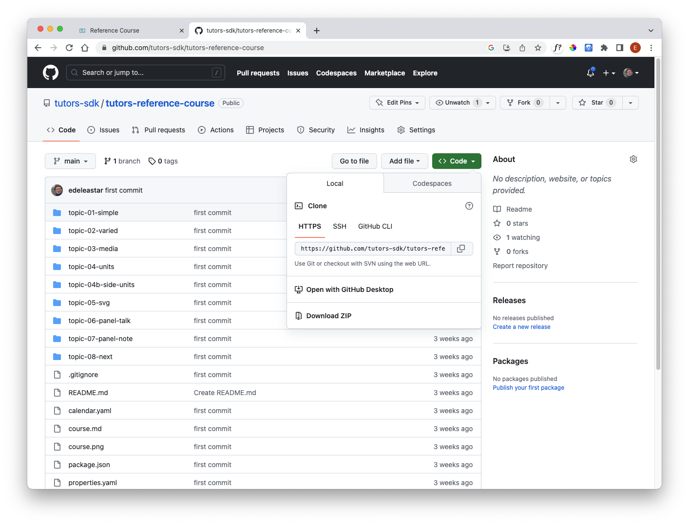

# Kitchen Sink

This has been a quick tour of some aspect of a tutors course.

- <https://reader.tutors.dev/course/reference-course>

This is a more complete course than the example we have been exploring. Inspect each of the topics and explore the varieties of potential learning objects.

Download the source of this course from here:

- <https://github.com/tutors-sdk/tutors-reference-course>

To download, select `Code` and then `Download ZIP` from the dropdown.

You should be able to deploy this course to your own Netlify account now.