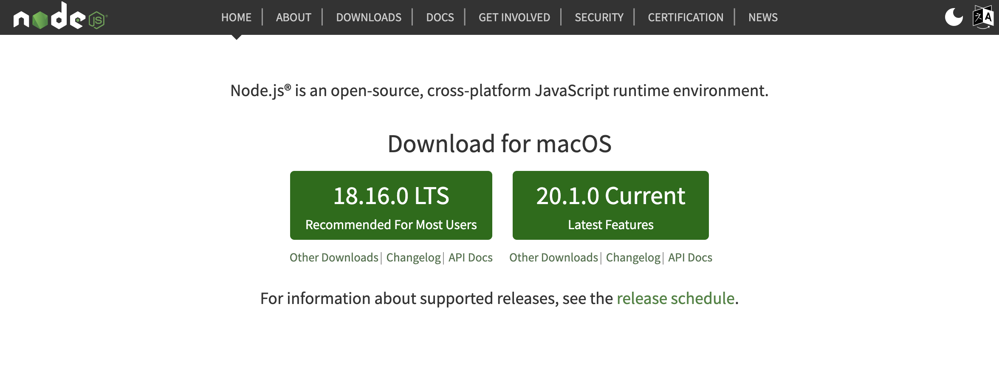
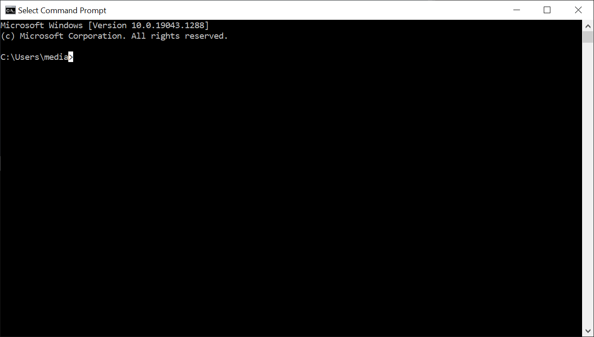

# Install Node.js

To publish the course, you will need to have Node.js installed on your workstation.

- [Node.js](https://nodejs.org)

Download and install the **LTS** version.

To verify that the installation has succeeded (and to publish updates to a course), you will need to run a `Command Prompt` on your workstation. On Windows, this can be reached via the `Start` menu:

Once launched, the command prompt looks like this:

To test if Node was installed correctly - type the following:

~~~
node -v
~~~

It should respond as follows:

~~~bash
v18.16.0
~~~

On a Mac, the equivalent of the Command Prompt is the Terminal:

The same command as above will look like this:

(The version number will match the latest node version).

