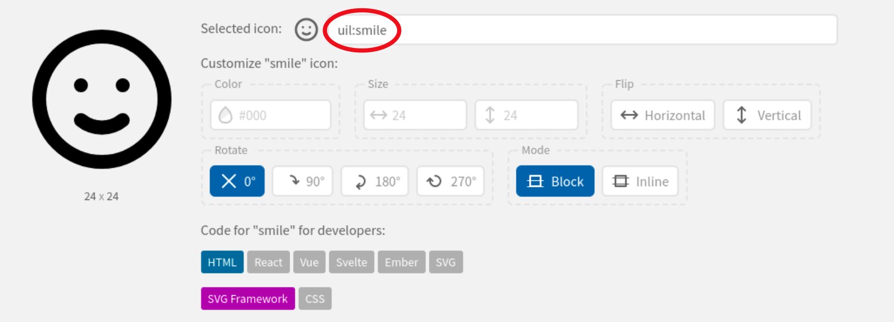

# Editing an icon

Now we are going to change an icon in the starter course. 

In your chosen code editor, navigate to */topic-01/unit-1/talk-1/talk-1.md*. It will look something like this:

Pay attention to the icon code at the top of the markdown file.

~~~
---

icon:
  type: uil:presentation
  color: 00979b

---
~~~

We are going to change the icon type and colour. Navigate to [Iconify](https://icon-sets.iconify.design/.). This site has thousands of icons available to you. 

Look through the different icon sets and select an icon you would like to be displayed on the card. 

Grab the code that displays when you select an icon as seen below:

Replace the old icon code with the new one. 

If you wish to change the colour of the icon, you can replace the colour code with a new hex colour value. [Google's colour picker](https://g.co/kgs/N1FG64) is a good aid to use. Typing in a colour like 'blue' will also work. 

Save the file and recompile it by typing `npx tutors-json` into the terminal. 

Drag and drop the newly generated JSON folder to the Netlify drop area for your published site. 

Check if the changes you made are on the live site.

