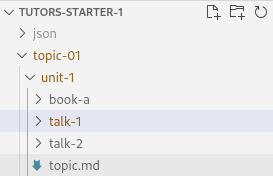

# Adding a talk

We are going to add a talk to Unit 1 within `topic-01.`

Let's revisit the file structure. In Unit 1 we currently have two talks and a lab. 

The easiest way to add another talk card is to copy and paste it. Right-click on `talk-1` and click `Copy.`

Right-click on `unit-1` and click `Paste`. This adds another folder called `talk-1-copy.` We can rename this folder to `talk-3`. 

We would then edit the markdown file to change the card title and icon. 

If you would like to use an icon you made or found on the web to replace the current icon, you can do so by first deleting the code at the top of the markdown file.

Find your image and download it. For this lab you can use the picture below.

Place the image you downloaded into the `talk-3` folder. Delete the current `talk-2.jpg` file and rename the new image `talk-2.png`. The file name has to match that of the markdown file and the PDF.

We can also change the `.pdf` to the content we want to be displayed. This action can be used to add more labs and units also. 

Save the file and recompile it by typing `npx tutors-publish` into the terminal. 

Drag and drop the newly generated JSON folder to the Netlify drop area for your published site. 

Check if the changes you made are on the live site.

