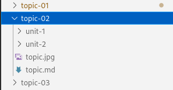
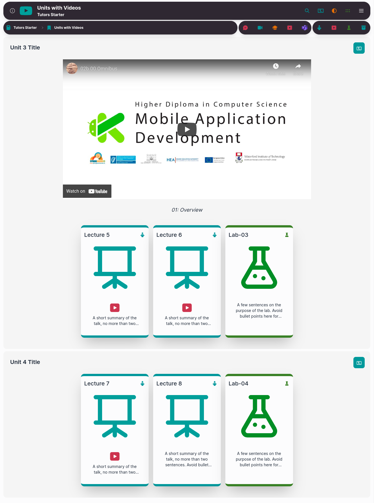
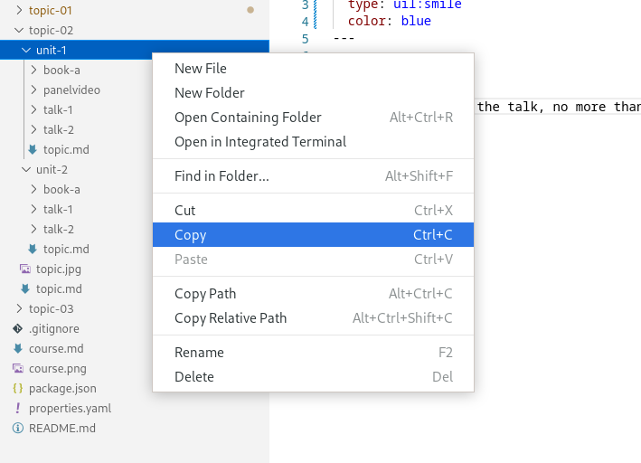

# Adding a unit

We are going to add another unit to our course. 

This time we are going to edit `topic-02`, the `Units with Videos` card. In this topic we already have 2 units.

The easiest way to add another unit is to copy and paste it. The two units we currently have are different. The first unit has a panel video and the second is a regular unit. You can choose which unit to copy. Right-click on the chosen unit and click `Copy.`

Right-click on `topic-2` and click `Paste`. This adds in another folder called `unit-1-copy`. We can rename this folder to `unit-3`. 

We would then edit the markdown file and change the content we want to be displayed within this unit. 

Save the file and recompile it by typing `npx tutors-puiblish` into the terminal. 

Drag and drop the newly generated JSON folder to the Netlify drop area for your published site. 

Check if the changes you made are on the live site.
