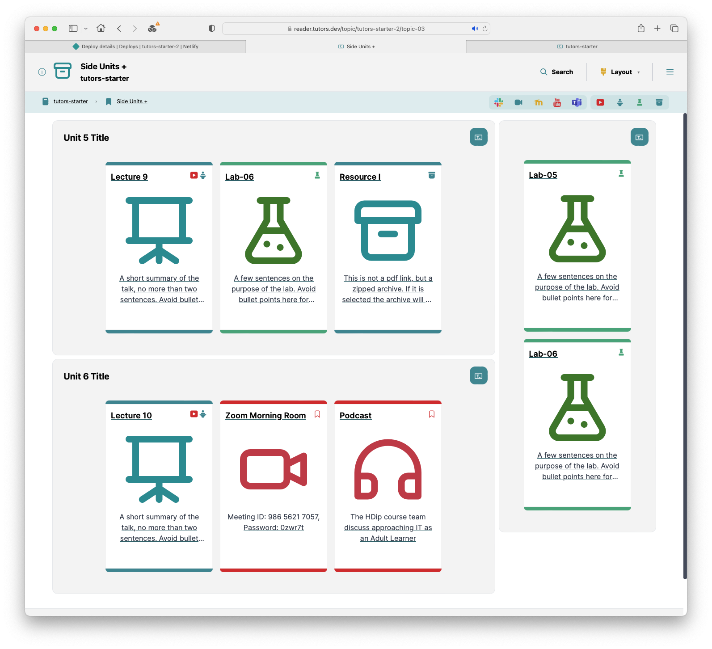

# Adding a lab

We are going to add another lab to our course. 

Open the the 'Side Units+' topic:

Now locate the side-unit folder in topic-03 in the course folder, and duplicate the book-b folder, calling it book-c

Proceed to rebuild & publish:

- Npx tutors-publish
- Drag/drop `json` folder to Netlify
- Open the published course:
- 