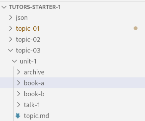
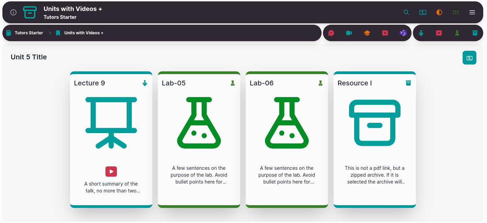
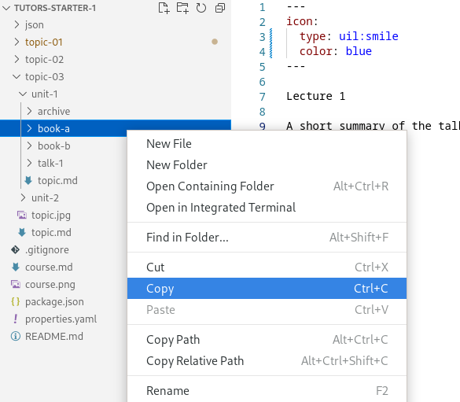
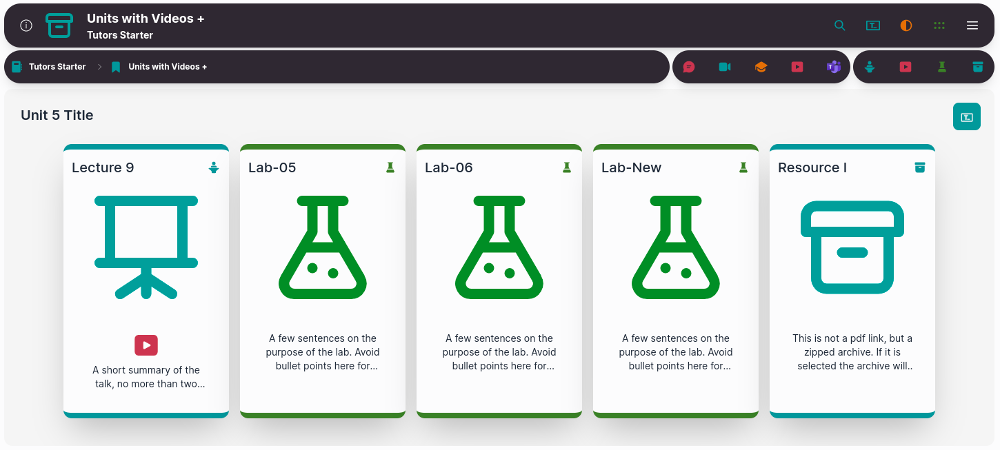

# Adding a lab

We are going to add another lab to our course. 

This time we are going to edit the first unit in `topic-03`, the `Units with Videos+` card. In this unit we already have 2 labs. [Note: labs are referred to as `book-*` in the file structure.]

The easiest way to add another lab is to copy and paste it.  Right-click on the chosen lab and click `Copy.`

Right-click on `unit-1` and click `Paste`. This adds in another folder called `book-a-copy`. We can rename this folder to `book-c`. 

We would then edit the markdown files within the `book-c` folder and change it to the content we want to be displayed.

Save the file and recompile it by typing `npx tutors-json` into the terminal. 

Drag and drop the newly generated JSON folder to the Netlify drop area for your published site. 

Check if the changes you made are on the live site.

