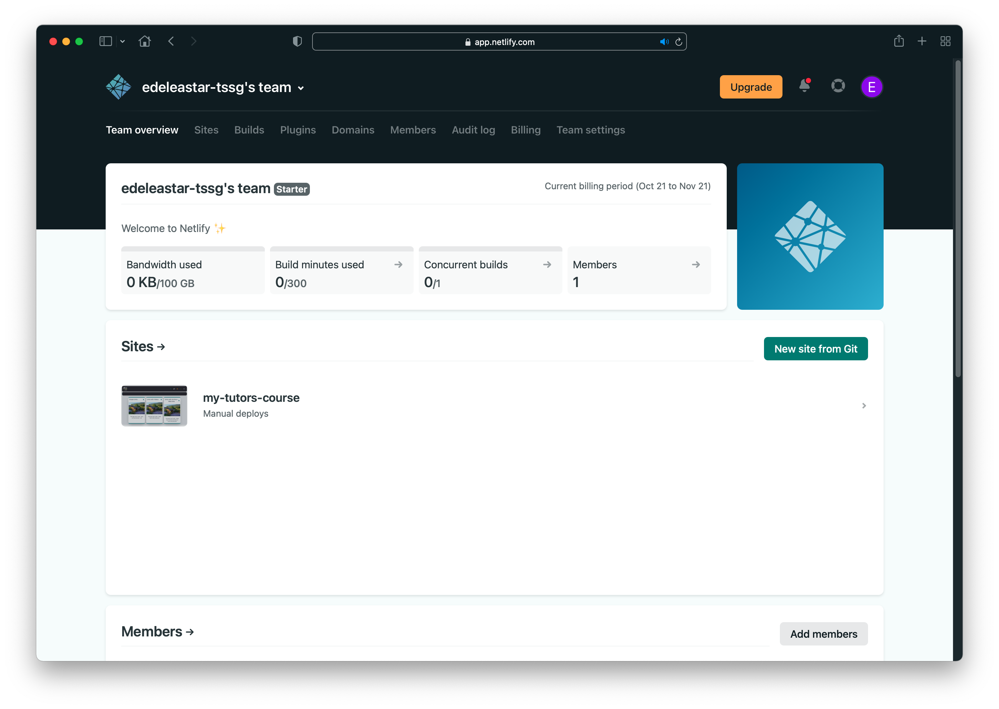
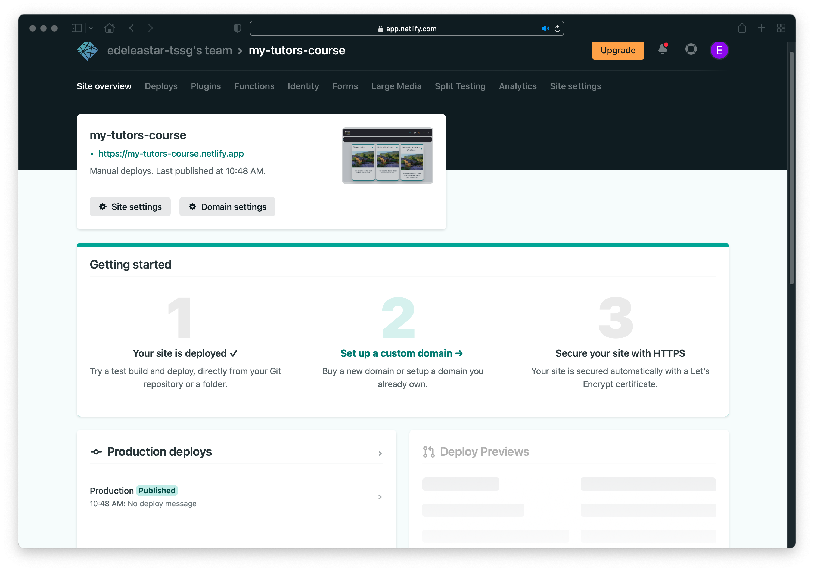
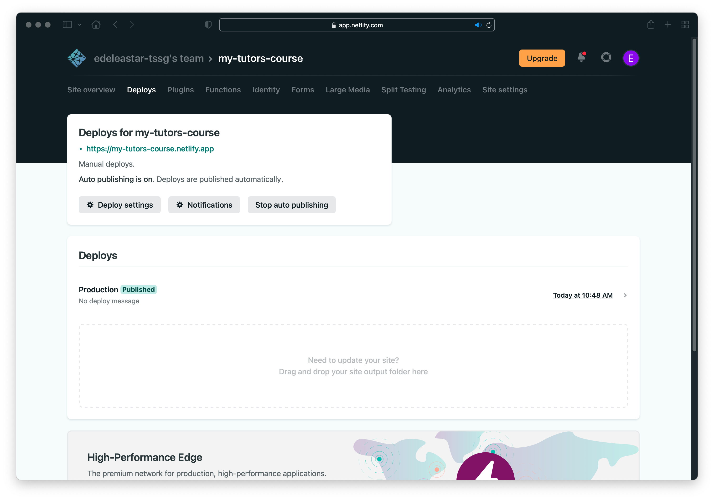
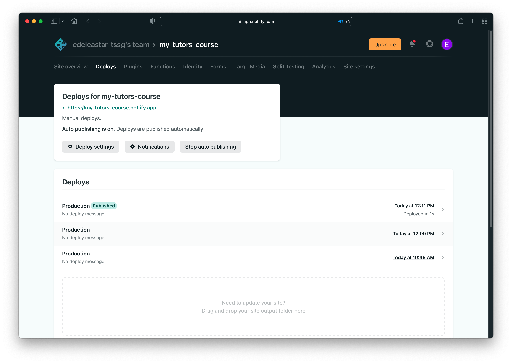

# Republish

To republish a course, proceed through the same steps as in the previous lab. These steps are summarised here:

Open a command prompt, enter `cd ` (with a space at the end) and then drag and drop the folder containing your course onto the prompt:

This will insert the full path of the folder (see above). Press `Return or Enter`

To compile the course, enter the following, then press `Enter`:

~~~
npx tutors-json
~~~

In a few minutes, you should see the above - a list of the course contents. The `json` directory will have been updated to the latest version.

The final step is to drag and drop this generated folder onto the Netlify project we set up in the last lab.  

First, revisit the project on Netlify:

Navigate into the project:

Select `Deploys`:

You should see the drag & drop zone above. Proceed now to drag and drop the `json` folder again. If all goes well you should see a new deploy listed:

 

Check if the changes you made are on the live site. You can also see a summary of what was updated by clicking on the most recent deploy:

Now revisit the published site to see if your updates have been implemented.