Tutors Mono Repo Architecture

Comprehensive architectural overview, onboarding guide, and reference for the Tutors monorepo ecosystem.

[[toc]]

## Overview

The **Tutors Monorepo** is a comprehensive workspace containing the complete Tutors educational platform ecosystem. It unifies course generation tools, UI component libraries, reader applications, and real-time services into a single, well-architected repository using pnpm workspaces.

### Key Capabilities

**Course Generation**:
- Transform markdown-based content into structured course data
- Generate JSON representations or static HTML
- CLI tools for content authors

**Course Reading**:
- Interactive web-based course viewer
- Real-time student presence tracking
- Analytics and engagement metrics
- Multiple theme and layout options

**Platform Features**:
- Multi-language support (i18n)
- Accessibility features (dyslexia-friendly fonts, reduced motion)
- GitHub OAuth authentication
- Live collaboration via WebSockets
- Course cataloging and discovery

### Ecosystem Components

This monorepo contains **4 distinct subsystems**:

1. **JSR Packages** - Deno-compatible libraries for course generation and data models
2. **Svelte Packages** - UI components and services for web applications
3. **Applications** - End-user facing applications (reader, catalogue, live)
4. **Services** - Backend infrastructure (PartyKit for real-time features)

---

## Monorepo Architecture

### Workspace Structure

The repository uses **pnpm workspaces** for package management, enabling:

- Shared dependencies across packages
- Fast installation and linking
- Workspace protocol (`workspace:*`) for internal dependencies
- Independent versioning of packages

**Workspace Configuration** (`pnpm-workspace.yaml`):

```yaml
packages:
  - "packages/jsr/*"
  - "packages/svelte/*"
  - "packages/svelte/utils/*"
  - "apps/*"
```

### Architectural Layers

The monorepo follows a **layered architecture** with clear dependency boundaries:

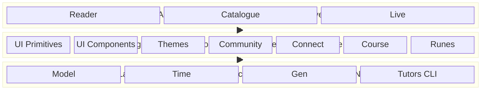

### Key Principles

1. **Bottom-Up Dependencies**: Lower layers never depend on higher layers
2. **Package Isolation**: Each package has clear boundaries and responsibilities
3. **Shared Types**: JSR packages provide TypeScript types used across the ecosystem
4. **Runtime Compatibility**: JSR packages work in both Deno and Node.js
5. **Svelte-Specific**: Svelte packages leverage Svelte 5 reactivity

---

## Technology Stack

### Core Technologies

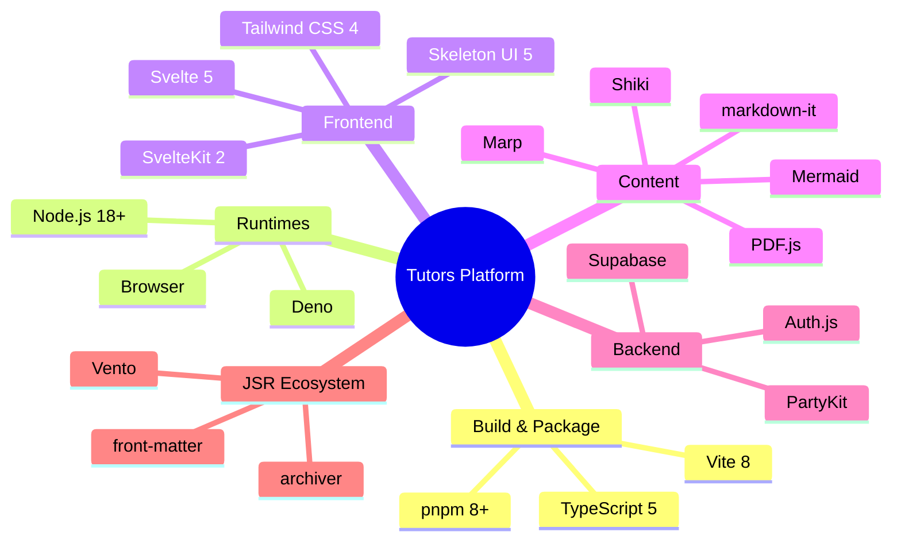

**Build & Package Management**:
- **pnpm 8+**: Fast, disk-efficient package manager with workspace support
- **Vite 8.x**: Next-generation build tool and dev server
- **TypeScript 5+**: Type-safe development across all packages

**Runtime Environments**:
- **Deno**: For JSR packages and CLI tools
- **Node.js 18+**: For Svelte packages and applications
- **Browser**: For client-side applications

**Frontend Framework**:
- **Svelte 5**: Reactive UI framework with runes-based state
- **SvelteKit 2**: Full-stack framework with SSR/CSR
- **Tailwind CSS 4**: Utility-first styling
- **Skeleton UI 5**: Svelte component library

**Content Processing**:
- **markdown-it**: Markdown parsing
- **Shiki**: Syntax highlighting
- **Marp**: Presentation rendering
- **Mermaid**: Diagram rendering
- **PDF.js**: PDF viewing

**Backend Services**:
- **Supabase**: Database, authentication, analytics
- **PartyKit**: Real-time WebSocket communication
- **Auth.js**: GitHub OAuth integration

**JSR Ecosystem** (Deno-first):
- **Vento**: Template engine for HTML generation
- **archiver**: ZIP file creation
- **front-matter**: YAML parsing

---

## Package Structure

### Directory Layout

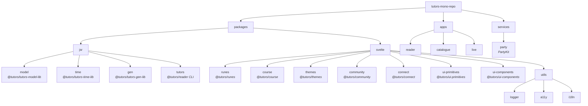

### Package Naming Convention

**JSR Packages**: `@tutors/tutors-[name]-lib` or `@tutors/[name]`
- Published to JSR registry for Deno ecosystem
- Can be imported in Node.js via npm compatibility layer

**Svelte Packages**: `@tutors/[name]`
- Internal workspace packages
- Svelte 5 specific with `.svelte.ts` reactive files

---

## JSR Subsystem

The JSR (JavaScript Registry) subsystem provides the **foundation layer** - core data models, course generation tools, and CLI utilities that work across both Deno and Node.js runtimes.

### Architecture Overview

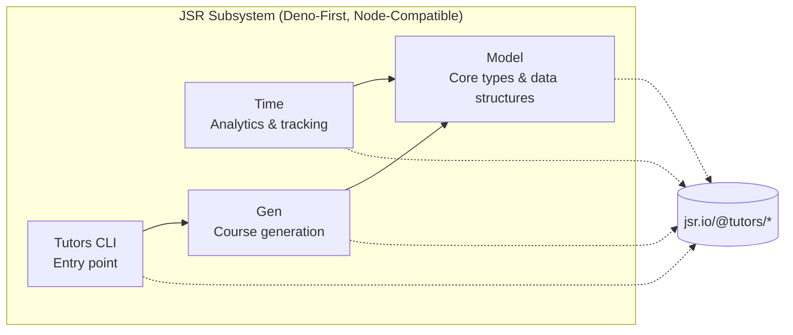

### 1. Model Package (`packages/jsr/model`)

**Package Name**: `@tutors/tutors-model-lib`
**Purpose**: Core data structures, types, and utilities

#### Key Responsibilities

- **Type Definitions**: TypeScript interfaces for all learning objects
- **Data Models**: Course, Topic, Lab, Talk, Video, Note, etc.
- **Markdown Processing**: markdown-it configuration and plugins
- **Utility Functions**: Tree traversal, search, course utilities

#### Core Types

```typescript
// Learning Object (Lo) - The fundamental unit
interface Lo {
  type: LoType;              // "course" | "topic" | "lab" | "talk" | etc.
  title: string;             // Display title
  summary?: string;          // Optional description
  route: string;             // URL path
  img?: string;              // Card image
  video?: string;            // Video URL
  pdf?: string;              // PDF URL
  icon?: IconType;           // Icon configuration
  los?: Lo[];                // Child learning objects
  hide?: boolean;            // Hide from navigation
}

// Course - Top-level container
interface Course extends Lo {
  type: "course";
  url: string;               // Base URL for assets
  topicIndex: Map<string, Lo>;
  labIndex: Map<string, Lo>;
}

// Icon configuration
interface IconType {
  type: string;              // Icon type identifier
  color?: string;            // Icon color
}
```

#### File Structure

```
packages/jsr/model/src/
├── tutors.ts                # Main export
├── types/
│   ├── learning-objects.ts  # Lo, Course, Topic types
│   ├── icon-types.ts        # Icon configurations
│   ├── media-types.ts       # Video, PDF types
│   ├── calendar-types.ts    # Calendar structures
│   └── tutors-id-types.ts   # Identifier types
├── utils/
│   ├── lo-utils.ts          # Learning object utilities
│   ├── course-utils.ts      # Course tree manipulation
│   ├── markdown-utils.ts    # Markdown processing
│   └── markdown-plugins.ts  # Custom markdown-it plugins
└── services/
    ├── lo-tree.ts           # Tree traversal and decoration
    └── search.ts            # Search functionality
```

#### Usage Example

```typescript
import { type Course, type Lo } from "@tutors/tutors-model-lib";

// Traverse course tree
function visitLo(lo: Lo, visitor: (lo: Lo) => void) {
  visitor(lo);
  lo.los?.forEach((child) => visitLo(child, visitor));
}
```

### 2. Time Package (`packages/jsr/time`)

**Package Name**: `@tutors/tutors-time-lib`
**Purpose**: Analytics, time tracking, and learning metrics

#### Key Responsibilities

- **Event Tracking**: Learning event capture and storage
- **Calendar Models**: Time-based activity views
- **Lab Analytics**: Step-by-step progress tracking
- **Supabase Integration**: Data persistence layer

#### Core Services

```typescript
// TutorsTime - Main analytics service
interface TutorsTime {
  logLearningEvent(event: LearningEvent): Promise<void>;
  getCourseMetrics(courseId: string): Promise<CourseMetrics>;
  getStudentActivity(userId: string): Promise<Activity[]>;
}

// CourseTime - Course-specific analytics
interface CourseTime {
  calendar: CalendarModel;
  labs: Map<string, LabModel>;
  calculateEngagement(userId: string): number;
}
```

#### Data Models

```typescript
interface LearningEvent {
  userId: string;
  courseId: string;
  loRoute: string;
  loType: string;
  timestamp: Date;
  duration?: number;
}

interface CalendarModel {
  days: Map<string, DayActivity>;
  weeks: WeekActivity[];
  totalTime: number;
}

interface LabModel {
  labId: string;
  steps: StepActivity[];
  completionRate: number;
}
```

#### File Structure

```
packages/jsr/time/src/
├── index.ts                # Main export
├── types/
│   ├── tutors-time-types.ts
│   ├── calendar-types.ts
│   ├── lab-types.ts
│   └── tutors-connect-types.ts
├── services/
│   ├── tutors-time.ts      # Main analytics service
│   ├── course-time.ts      # Course metrics
│   ├── base-calendar-model.ts
│   ├── base-lab-model.ts
│   └── supabase.ts         # Supabase client
└── utils/
    ├── calendar-utils.ts
    └── lab-utils.ts
```

### 3. Gen Package (`packages/jsr/gen`)

**Package Name**: `@tutors/tutors-gen-lib`
**Purpose**: Course content generation from markdown source

#### Key Responsibilities

- **Content Parsing**: Read markdown files and extract metadata
- **JSON Generation**: Create `tutors.json` course structure
- **HTML Generation**: Create static HTML for tutors-lite
- **Asset Processing**: Copy and organize course assets
- **Template Rendering**: Vento-based HTML templates

#### Key Components

**CourseBuilder** (`services/course-builder.ts`):
- Scans folder structure
- Identifies learning object types from folder/file patterns
- Builds hierarchical course tree

**ResourceBuilder** (`services/resource-builder.ts`):
- Reads markdown frontmatter (YAML)
- Extracts title, summary, images
- Processes content markdown

**TemplateEngine** (`templates/template-engine.ts`):
- Loads Vento templates for HTML generation
- Renders Lo-specific views (Lab.vto, Talk.vto, etc.)
- Applies theme styles

**CourseEmitter** (`services/course-emitter.ts`):
- Writes `tutors.json` (for reader consumption)
- OR generates `html/` folder (for tutors-lite)

#### File Structure

```
packages/jsr/gen/src/
├── services/
│   ├── course-builder.ts   # Folder parsing
│   ├── resource-builder.ts # Metadata extraction
│   └── course-emitter.ts   # Output generation
└── templates/
    ├── template-engine.ts  # Vento integration
    ├── template-downloader.ts
    ├── styles.ts           # CSS injection
    ├── utils.ts
    └── vento/              # HTML templates
        ├── Composite.vto
        ├── Lab.vto
        ├── Talk.vto
        ├── Topic.vto
        └── components/
            ├── cards/
            ├── navigators/
            └── ...
```

#### Folder Structure Convention

Example source structure:

```
my-course/
├── properties.yaml         # Course metadata
├── topic-01/
│   ├── unit-1/             # Unit container
│   │   ├── book-a/         # Lab (folder with steps)
│   │   │   ├── book-a.md   # Lab overview
│   │   │   ├── 01.md       # Step 1
│   │   │   ├── 02.md       # Step 2
│   │   │   └── archives/   # Archives
│   │   ├── talk-1.md       # Talk (markdown)
│   │   └── video-1.md      # Video (markdown with video URL)
│   └── properties.yaml
└── topic-02/
    └── ...
```

Generated output (JSON mode):

```
json/
├── tutors.json             # Course tree structure
├── topic-01/
│   ├── book-a/
│   │   ├── book-a.json     # Lab step data
│   │   └── ...
│   └── ...
└── ...
```

### 4. Tutors Package (`packages/jsr/tutors`)

**Package Name**: `@tutors/reader` (or `@tutors/tutors`)
**Purpose**: CLI entry point for course generation

#### Key Responsibilities

- **CLI Interface**: Command-line tool for authors
- **Orchestration**: Coordinates gen package services
- **Configuration**: Reads Deno configuration and environment

#### Usage

```bash
# Generate JSON course
deno run -A jsr:@tutors/reader

# Or locally
deno run -A packages/jsr/tutors/main.ts
```

#### File Structure

```
packages/jsr/tutors/
├── deno.json              # JSR package configuration
├── main.ts                # CLI entry point
└── readme.md              # Usage documentation
```

#### main.ts Structure

```typescript
import { CourseBuilder, CourseEmitter } from "@tutors/tutors-gen-lib";

// Parse command-line args
const args = parseArgs(Deno.args);

// Build course from source folder
const builder = new CourseBuilder(args.source);
const course = await builder.build();

// Emit JSON or HTML
const emitter = new CourseEmitter(args.output, args.mode);
await emitter.emit(course);

console.log(`Course generated: ${args.output}`);
```

### JSR Publishing Workflow

**Deno Configuration** (`deno.json`):

```json
{
  "workspace": [
    "./packages/jsr/model",
    "./packages/jsr/time",
    "./packages/jsr/gen",
    "./packages/jsr/tutors"
  ],
  "imports": {
    "@tutors/tutors-model-lib": "jsr:@tutors/tutors-model-lib@^5.0.0",
    "@tutors/tutors-time-lib": "jsr:@tutors/tutors-time-lib@^5.0.0"
  }
}
```

**Publishing Commands**:

```bash
# Publish to JSR
cd packages/jsr/model
deno publish

# Or via npx (for npm compatibility)
npx jsr publish
```

**Consumption**:

```typescript
// In Deno
import { type Course } from "jsr:@tutors/tutors-model-lib@^5.0";

// In Node.js (via npm)
import { type Course } from "@tutors/tutors-model-lib";
```

---

## Svelte Package Ecosystem

The Svelte subsystem provides **reactive UI components**, **services**, and **state management** for web applications. All packages leverage Svelte 5's runes-based reactivity.

### Architecture Overview

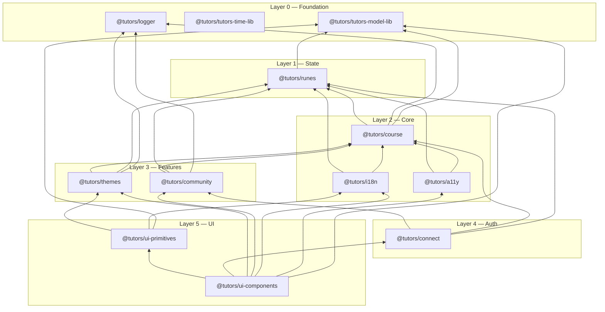

### Layer Structure

**Foundation (Layer 1)**:
- `runes` - Reactive state management
- `utils/logger` - Logging

**Core (Layer 2)**:
- `course` - Course data processing
- `utils/a11y` - Accessibility
- `utils/i18n` - Internationalization

**Features (Layer 3)**:
- `themes` - Theme management
- `community` - Analytics and presence

**UI (Layer 4)**:
- `ui-primitives` - Primitive UI components (Icon, Menu, Sidebar, Image)
- `ui-components` - High-level UI components (navigators, learning objects, time views, TutorsShell)

### 1. Runes Package (`packages/svelte/runes`)

**Package Name**: `@tutors/runes`
**Purpose**: Global reactive state using Svelte 5 runes

#### Key Exports

```typescript
// Lazy-initialized reactive state
export const currentCourse: {
  get value(): Course | null;
  set value(v: Course | null);
};

export const currentLo: {
  get value(): Lo | null;
  set value(v: Lo | null);
};

export const currentLabStepIndex: {
  get value(): number;
  set value(v: number);
};

export const layout: {
  get value(): "expanded" | "compacted";
  set value(v: "expanded" | "compacted");
};

export const transientUpdate: {
  get value(): boolean;
  set value(v: boolean);
};
```

#### Implementation Pattern

```typescript
// index.svelte.ts (must use .svelte.ts extension for runes)
import type { Course } from "@tutors/tutors-model-lib";

const rune = <T>(initialValue: T) => {
  let _rune = $state(initialValue);
  return {
    get value() { return _rune; },
    set value(v: T) { _rune = v; }
  };
};

// Lazy initialization to avoid SSR issues
let _currentCourse: ReturnType<typeof rune<Course | null>> | null = null;

export const currentCourse = {
  get value() {
    return (_currentCourse ??= rune(null)).value;
  },
  set value(v) {
    (_currentCourse ??= rune(null)).value = v;
  }
};
```

#### Usage in Components

```svelte
<script lang="ts">
  import { currentCourse } from "@tutors/runes";

  $effect(() => {
    if (currentCourse.value) {
      console.log("Course changed:", currentCourse.value.title);
    }
  });
</script>

<h1>{currentCourse.value?.title}</h1>
```

### 2. Course Package (`packages/svelte/course`)

**Package Name**: `@tutors/course`
**Purpose**: Course loading, processing, and markdown rendering

#### Sub-modules

**Course Service** (`course/services/course.svelte.ts`):
- Fetches course JSON from CDN
- Caches loaded courses
- Manages lab instances
- Decorates course tree with URLs

**Live Lab** (`course/services/live-lab.ts`):
- Manages lab step navigation
- Fetches markdown content for steps
- Converts markdown to HTML
- Tracks current step state

**Live Notebook** (`course/services/live-notebook.ts`):
- Manages Jupyter notebook rendering
- Cell-by-cell content processing

**Lo Tree** (`course/services/lo-tree.ts`):
- Tree traversal utilities
- URL decoration
- Index building (topicIndex, labIndex, etc.)

**Markdown Service** (`markdown/services/markdown.svelte.ts`):
- Markdown-to-HTML conversion
- Syntax highlighting with Shiki
- Mermaid diagram rendering
- Marp presentation rendering
- Code block copy button action

#### File Structure

```
packages/svelte/course/src/
├── course/
│   ├── index.ts
│   ├── types.ts
│   └── services/
│       ├── course.svelte.ts
│       ├── live-lab.ts
│       ├── live-notebook.ts
│       └── lo-tree.ts
├── markdown/
│   ├── index.ts
│   ├── types.ts
│   ├── services/
│   │   ├── markdown.svelte.ts
│   │   ├── marp-renderer.ts
│   │   └── mermaid-action.ts
│   └── actions/
│       └── copy-code-action.ts
└── index.ts
```

#### Usage Example

```typescript
import { courseService } from "@tutors/course";

// Load course
const course = await courseService.readCourse("my-course-id", fetch);

// Load lab
const lab = await courseService.readLab(course, "lab-01", fetch);
await lab.loadStep("01");

// Render markdown
import { markdownService } from "@tutors/course";
const html = await markdownService.renderMarkdown(content);
```

### 3. Themes Package (`packages/svelte/themes`)

**Package Name**: `@tutors/themes`
**Purpose**: UI theming, icons, and display modes

#### Features

- **Display Modes**: Light/dark theme toggle
- **Icon Sets**: Multiple icon theme choices (Fluent, Hero, Easter, Festive)
- **Layouts**: Expanded/compacted card layouts
- **Card Styles**: Portrait/landscape/circular card modes
- **Festive Mode**: Snow animation effect

#### Theme Service

```typescript
export const themeService: ThemeService = {
  // Display mode
  currentDisplayMode: $state("light"),
  toggleDisplayMode(): void,
  setDisplayMode(mode: "light" | "dark"): void,

  // Icons
  currentIconSet: $state("fluent"),
  setIconSet(set: string): void,
  getIcon(type: string): IconType,

  // Layouts
  currentLayout: $state("expanded"),
  setLayout(layout: "expanded" | "compacted"): void,

  // Card styles
  currentCardStyle: $state("portrait"),
  setCardStyle(style: "portrait" | "landscape" | "circular"): void,

  // Persistence
  initDisplay(): void,
  saveTheme(): void
};
```

#### File Structure

```
packages/svelte/themes/src/
├── index.ts
├── types.ts
├── services/
│   └── themes.svelte.ts
├── icons/
│   ├── fluent-icons.ts
│   ├── hero-icons.ts
│   ├── easter-icons.ts
│   └── festive-icons.ts
├── styles/
│   ├── tutors.css
│   ├── classic.css
│   ├── dyslexia.css
│   ├── easter.css
│   ├── prose-headings.css
│   └── card-styles.ts
└── events/
    ├── festive.svelte.ts
    └── snow.ts
```

### 4. Community Package (`packages/svelte/community`)

**Package Name**: `@tutors/community`
**Purpose**: Analytics, real-time presence, and social features

#### Sub-services

**Analytics Service**:
- Tracks page views and learning events
- Sends data to Supabase

**Presence Service**:
- Course-specific student presence
- Real-time status updates via PartyKit

**Live Service**:
- Platform-wide live activity monitoring
- Online student count

**Catalogue Service**:
- Course directory management
- Visit statistics

#### File Structure

```
packages/svelte/community/src/
├── index.ts
├── types.svelte.ts
├── services/
│   ├── analytics.svelte.ts
│   ├── presence.svelte.ts
│   ├── live.svelte.ts
│   └── catalogue.ts
└── utils/
    └── supabase-client.ts
```

### 5. Connect Package (`packages/svelte/connect`)

**Package Name**: `@tutors/connect`
**Purpose**: User authentication and session management

#### Features

- GitHub OAuth integration
- User profile management
- Session persistence (localStorage or Supabase)
- Course access control

#### File Structure

```
packages/svelte/connect/src/
├── index.ts
├── types.ts
├── services/
│   ├── connect.svelte.ts
│   ├── localStorageProfile.ts
│   └── supabaseProfile.svelte.ts
└── utils/
    └── allCourseAccess.ts
```

### 6. UI Primitives Package (`packages/svelte/ui-primitives`)

**Package Name**: `@tutors/ui-primitives`
**Purpose**: Low-level, reusable primitive UI components

#### Components

- **Icon** - Iconify-based icon rendering with theme-aware type mapping
- **IconBar** - Horizontal icon strip
- **Image** - Responsive image with fallback
- **Menu / MenuItem** - Dropdown menu system
- **Sidebar** - Collapsible navigation sidebar
- **SetuIcon / TutorsIcon** - Branding icons

#### File Structure

```
packages/svelte/ui-primitives/src/
├── index.ts
├── _safelist.svelte
└── components/
    ├── Icon.svelte
    ├── IconBar.svelte
    ├── Image.svelte
    ├── Menu.svelte
    ├── MenuItem.svelte
    ├── Sidebar.svelte
    ├── SetuIcon.svelte
    └── TutorsIcon.svelte
```

### 7. UI Components Package (`packages/svelte/ui-components`)

**Package Name**: `@tutors/ui-components`
**Purpose**: High-level, domain-specific UI components

This package depends on `@tutors/ui-primitives` and produces a pre-compiled CSS file (`dist/style.css`) containing all Tailwind utilities and Skeleton theme styles required by the applications. It must be built before running any app.

#### Component Categories


#### File Structure

```
packages/svelte/ui-components/src/
├── TutorsShell.svelte      # Main app shell
├── styles.css              # Tailwind/Skeleton entry point
├── _dynamic-classes.css    # Safelist for @apply directives
├── _safelist.svelte        # Safelist for dynamic template classes
├── learning-objects/
│   ├── content/
│   ├── layout/
│   └── structure/
├── navigators/
├── time/
└── utils/
```

### 8. Utility Packages (`packages/svelte/utils/`)

**Logger** (`logger/`):
- `@tutors/logger` - Logging utility using loglevel

**Accessibility** (`a11y/`):
- `@tutors/a11y` - Reduced motion detection

**Internationalization** (`i18n/`):
- `@tutors/i18n` - Multi-language support (EN, DE, ES, FR, IT)

---

## Applications

### Application Architecture

All applications follow the **SvelteKit architecture**:

```
app/
├── src/
│   ├── routes/            # File-based routing
│   │   ├── +layout.svelte
│   │   ├── +page.svelte
│   │   └── [dynamic]/
│   ├── hooks.client.ts    # Client hooks
│   ├── hooks.server.ts    # Server hooks
│   ├── app.css            # Global styles
│   ├── app.html           # HTML template
│   └── app.d.ts           # TypeScript definitions
├── static/                # Static assets
├── svelte.config.js
├── vite.config.ts
└── package.json
```

### 1. Reader App (`apps/reader`)

**Purpose**: Main course reader application

**Route Groups**:
- `(auth)/` - Authentication routes
- `(course-reader)/` - Course content routes
- `(home)/` - Landing page and course list

**Key Routes**:
- `/` - Home/landing page
- `/course/[courseid]` - Course home
- `/topic/[courseid]/[...loid]` - Topic page
- `/lab/[courseid]/[...loid]` - Lab viewer
- `/talk/[courseid]/[...loid]` - Talk viewer
- `/video/[courseid]/[...loid]` - Video player
- `/note/[courseid]/[...loid]` - PDF viewer
- `/notebook/[courseid]/[...loid]` - Notebook viewer
- `/time/[courseid]` - Analytics dashboard
- `/search/[courseid]` - Course search

**Environment Configuration**:

```env
# Anon mode (no backend)
PUBLIC_ANON_MODE=TRUE

# Or full mode with services
PUBLIC_SUPABASE_URL=...
PUBLIC_SUPABASE_ANON_KEY=...
PUBLIC_party_kit_main_room=...
PRIVATE_AUTH_GITHUB_ID=...
PRIVATE_AUTH_GITHUB_SECRET=...
PRIVATE_AUTH_SECRET=...
```

### 2. Catalogue App (`apps/catalogue`)

**Purpose**: Course catalog and discovery

**Features**:
- Course listing with statistics
- Visit tracking
- Minimal UI for browsing

### 3. Live App (`apps/live`)

**Purpose**: Real-time student presence tracking

**Features**:
- Live student count per course
- Current page views
- Real-time updates via PartyKit

---

## Services

### PartyKit Service (`services/party`)

**Purpose**: Real-time WebSocket server for live presence

#### Architecture

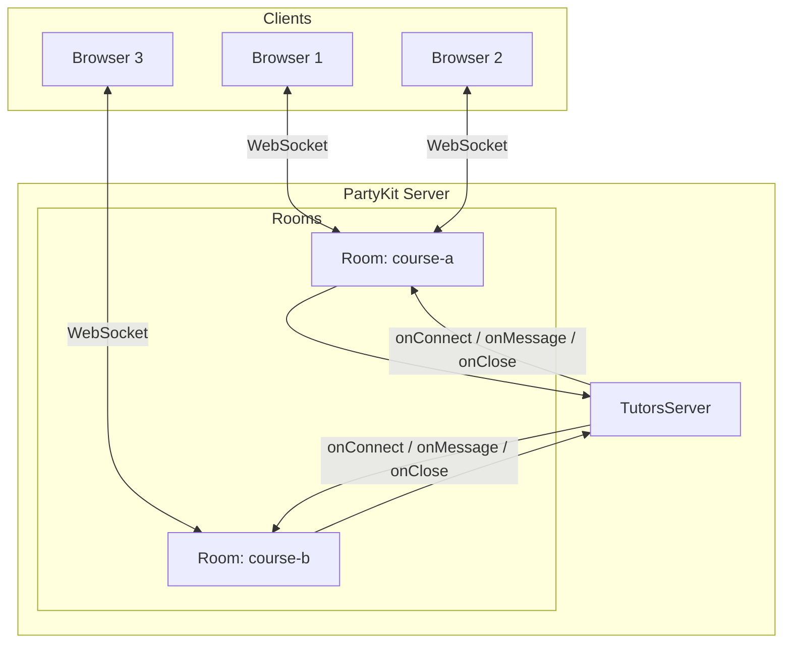

#### Server Implementation

**src/server.ts**:

```typescript
import type * as Party from "partykit/server";

export default class TutorsServer implements Party.Server {
  constructor(readonly room: Party.Room) {}

  onConnect(conn: Party.Connection, ctx: Party.ConnectionContext) {
    // New client connected
    console.log(`Client ${conn.id} joined room ${this.room.id}`);
  }

  onMessage(message: string, sender: Party.Connection) {
    // Broadcast to all clients in the room
    this.room.broadcast(message, [sender.id]);
  }

  onClose(conn: Party.Connection) {
    console.log(`Client ${conn.id} left room ${this.room.id}`);
  }
}
```

#### Client Usage

```typescript
import PartySocket from "partysocket";

const socket = new PartySocket({
  host: PUBLIC_party_kit_main_room,
  room: courseId
});

socket.addEventListener("message", (event) => {
  const data = JSON.parse(event.data);
  // Handle presence update
});

socket.send(JSON.stringify({
  type: "presence",
  user: userId,
  page: currentPage
}));
```

---

## Content Generation Pipeline

### End-to-End Flow


### Generation Modes

**JSON Mode** (Default):

```bash
deno run -A jsr:@tutors/reader
```

Output: `json/tutors.json` + markdown files

**HTML Mode** (Tutors Lite):

```bash
deno run -A jsr:@tutors/tutors-lite
```

Output: `html/` folder with self-contained static site

### Folder Structure Convention

```
course-folder/
├── properties.yaml          # Course metadata
│
├── topic-01/
│   ├── properties.yaml      # Topic metadata
│   ├── unit-1/              # Unit grouping
│   │   ├── book-a/          # Lab (folder = multi-step)
│   │   │   ├── book-a.md    # Lab overview
│   │   │   ├── 01.md        # Step 1
│   │   │   ├── 02.md        # Step 2
│   │   │   ├── img/         # Step images
│   │   │   └── archives/    # Downloadable archives
│   │   │
│   │   ├── talk-1.md        # Talk (single file)
│   │   ├── talk-1.pdf       # Talk PDF (optional)
│   │   │
│   │   ├── video-1.md       # Video (with video URL in frontmatter)
│   │   └── note-1.pdf       # Note (PDF document)
│   │
│   └── unit-2/
│       └── ...
│
└── topic-02/
    └── ...
```

### Markdown Frontmatter Examples

**Lab** (`book-a/book-a.md`):

```yaml
---
title: My Lab
summary: Interactive tutorial
icon: lab
---

# Lab Overview
This lab teaches...
```

**Talk** (`talk-1.md`):

```yaml
---
title: Introduction to TypeScript
summary: Learn TypeScript basics
icon: talk
pdf: talk-1.pdf
---

# Slide 1
Content...
```

**Video** (`video-1.md`):

```yaml
---
title: Demo Video
summary: Watch this demo
video: https://youtube.com/watch?v=...
---

Additional context...
```

---

## Reader Application Flow

### Course Loading Sequence

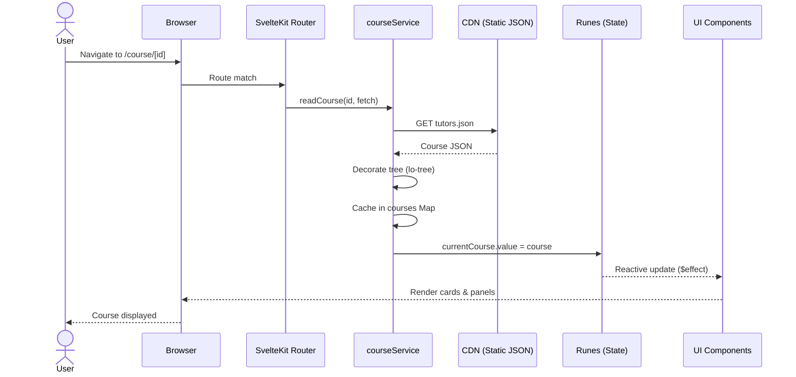

### Lab Viewing Sequence

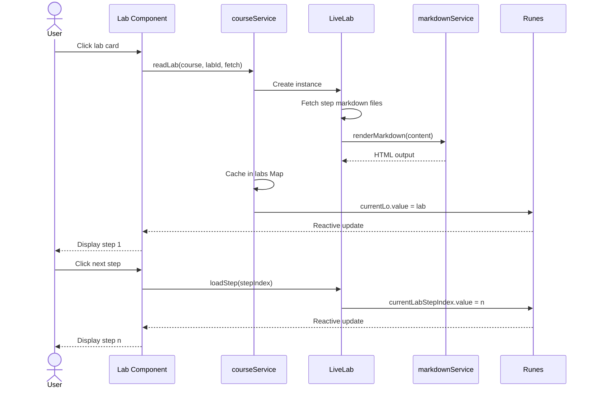

### Analytics & Presence Flow

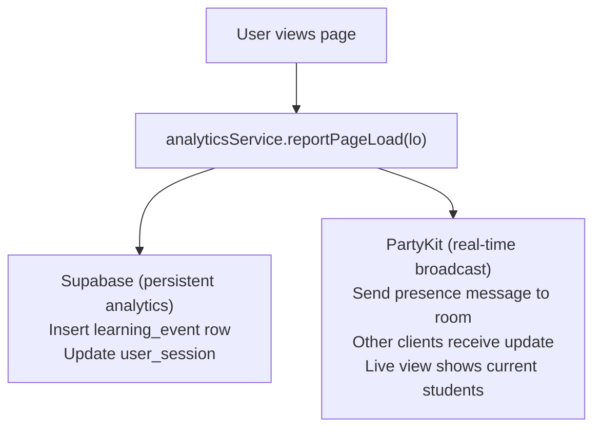

---

## Dependency Graph

### Package Dependencies

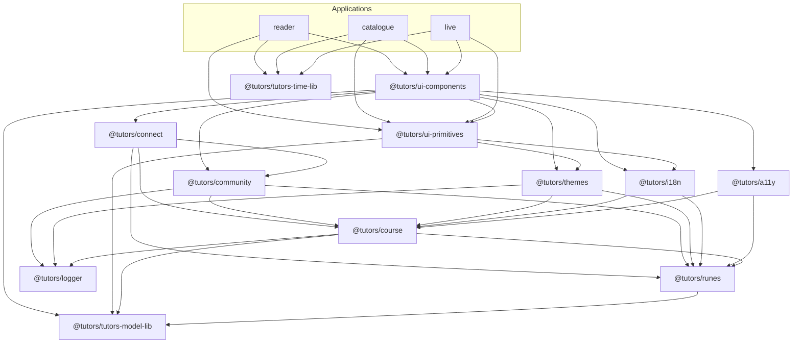

### Dependency Layers (Bottom-Up)

**Layer 0** (Foundation - no dependencies):
- `@tutors/tutors-model-lib`
- `@tutors/tutors-time-lib`
- `@tutors/logger`

**Layer 1** (depends on foundation):
- `@tutors/runes` → model

**Layer 2** (depends on runes + foundation):
- `@tutors/course` → runes, logger, model
- `@tutors/a11y` → runes, course
- `@tutors/i18n` → runes, course

**Layer 3** (depends on course + lower):
- `@tutors/themes` → course, runes, logger, model
- `@tutors/community` → course, runes, logger, model

**Layer 4** (depends on community + lower):
- `@tutors/connect` → community, course, runes, model

**Layer 5** (UI):
- `@tutors/ui-primitives` → themes, i18n, model
- `@tutors/ui-components` → ui-primitives + all packages

**Layer 6** (applications):
- `reader`, `catalogue`, `live` → ui-primitives, ui-components + other packages

---

## Data Flow

### State Management Flow

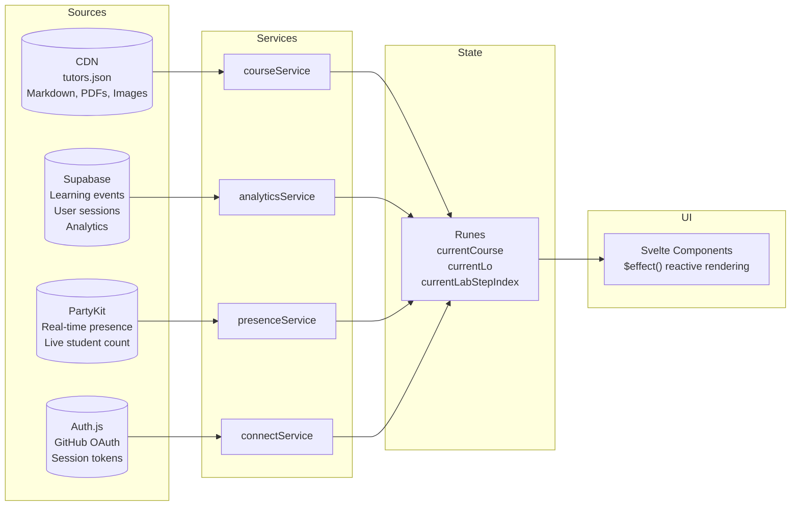

### Data Sources

**Static JSON (CDN)**:
- Course structure (`tutors.json`)
- Markdown content
- Images, PDFs, videos

**Supabase (Database)**:
- Learning events
- User sessions
- Course catalogue
- Analytics data

**PartyKit (WebSocket)**:
- Real-time presence
- Live student count
- Current page views

**Auth.js (OAuth)**:
- User authentication
- Session tokens

---

## Development Workflow

### Initial Setup

```bash
# Clone repository
cd /path/to/tutors-mono-repo

# Install dependencies
pnpm install

# Start reader app
cd apps/reader
pnpm dev
# Runs on http://localhost:5173
```

### Environment Configuration

**Anonymous Mode** (no backend):

```bash
# apps/reader/.env
PUBLIC_ANON_MODE=TRUE
```

**Full Mode** (with services):

```bash
# apps/reader/.env
PUBLIC_SUPABASE_URL=https://xxx.supabase.co
PUBLIC_SUPABASE_ANON_KEY=xxx
PUBLIC_party_kit_main_room=https://tutors.partykit.dev
PRIVATE_AUTH_GITHUB_ID=xxx
PRIVATE_AUTH_GITHUB_SECRET=xxx
PRIVATE_AUTH_SECRET=xxx
```

### Development Scripts

**Root**:

```bash
pnpm dev       # Run reader app
pnpm build     # Build reader app
```

**Per App**:

```bash
pnpm --filter reader dev
pnpm --filter catalogue dev
pnpm --filter live dev
```

**Per Package**:

```bash
pnpm --filter @tutors/ui-primitives build
pnpm --filter @tutors/ui-components build
pnpm --filter @tutors/course check
```

### Adding New Packages

```bash
# Create package directory
mkdir -p packages/svelte/my-package/src

# Create package.json
cat > packages/svelte/my-package/package.json << EOF
{
  "name": "@tutors/my-package",
  "version": "0.0.1",
  "type": "module",
  "exports": {
    ".": "./src/index.ts"
  },
  "dependencies": {
    "@tutors/tutors-model-lib": "workspace:*"
  }
}
EOF

# Install dependencies
pnpm install
```

### Hot Module Replacement (HMR)

Vite provides instant updates:

- Svelte components reload on change
- CSS updates without page refresh
- Service changes trigger re-import

### Type Checking

```bash
# Check all packages
pnpm -r check

# Check specific app
cd apps/reader
pnpm check
```

---

## Deployment Strategy

### JSR Package Publishing

```bash
# Publish model package
cd packages/jsr/model
deno publish

# Or all JSR packages
for pkg in packages/jsr/*; do
  cd $pkg
  deno publish
  cd -
done
```

### Application Deployment

**Reader App** (Netlify/Vercel):

```bash
cd apps/reader
pnpm build
# Outputs to build/
```

**Adapter Configuration** (`svelte.config.js`):

```javascript
import adapter from "@sveltejs/adapter-auto";

export default {
  kit: {
    adapter: adapter()
    // Auto-detects Netlify, Vercel, Cloudflare
  }
};
```

**Environment Variables** (production):

Set in Netlify/Vercel dashboard:

```
PUBLIC_SUPABASE_URL
PUBLIC_SUPABASE_ANON_KEY
PUBLIC_party_kit_main_room
PRIVATE_AUTH_GITHUB_ID
PRIVATE_AUTH_GITHUB_SECRET
PRIVATE_AUTH_SECRET
PUBLIC_PDF_KEY
```

### PartyKit Service Deployment

```bash
cd services/party
npx partykit deploy
```

Configuration (`partykit.json`):

```json
{
  "name": "tutors",
  "main": "src/server.ts"
}
```

### Course Deployment

After generating course:

```bash
# Generate course
cd /path/to/course-source
deno run -A jsr:@tutors/reader

# Deploy json/ folder
cd json
netlify deploy --prod
# Or any static host: Vercel, GitHub Pages, etc.
```

---

## Contributing Guidelines

### Getting Started

1. **Fork the repository**
2. **Clone your fork**
3. **Create a feature branch** from `development`
4. **Make your changes**
5. **Test locally**
6. **Submit a Pull Request** to `development`

### Branch Strategy (GitFlow)

- `main` - Production releases
- `development` - Integration branch
- `feature/*` - Feature branches
- `fix/*` - Bug fix branches

### Commit Message Convention

```
Add: New feature or package
Update: Enhancement to existing code
Fix: Bug fix
Refactor: Code restructuring
Docs: Documentation changes
Style: Code formatting
Test: Add or update tests
```

### Code Quality

**Type Safety**:

```bash
pnpm -r check
```

### Pull Request Checklist

- Branch from `development`
- Code follows existing patterns
- No TypeScript errors
- Changes tested locally
- Dependencies updated if needed
- Documentation updated
- Commit messages are clear
- PR description explains changes

---

## Appendix

### Glossary

- **Lo (Learning Object)**: Atomic unit of content
- **JSR**: JavaScript Registry (Deno package registry)
- **Rune**: Svelte 5 reactive primitive ($state, $derived, $effect)
- **SSR**: Server-Side Rendering
- **CSR**: Client-Side Rendering
- **PartyKit**: Real-time WebSocket platform
- **Tutors Connect**: Authentication system
- **Tutors Time**: Analytics and time tracking

### Useful Links

- **Live Platform**: https://tutors.dev
- **Reference Manual**: https://tutors-reference-manual.netlify.app
- **JSR Registry**: https://jsr.io/@tutors
- **PartyKit**: https://partykit.io
