Tutors Mono Repo Architecture

An illustrated guide to the Tutors monorepo architecture, rendered as Mermaid diagrams.

[[toc]]

## Layered Architecture

The monorepo follows a layered architecture with clear dependency boundaries. Lower layers never depend on higher layers.

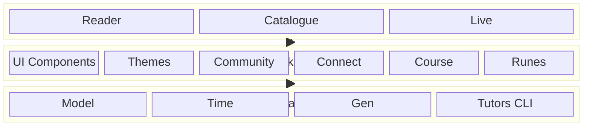

## Package Structure

The directory layout of the monorepo, showing the four subsystems: JSR packages, Svelte packages, Applications, and Services.

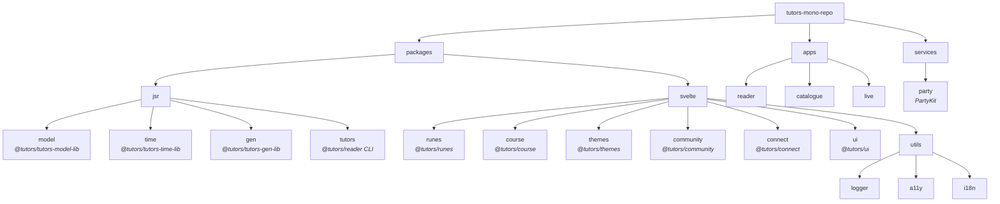

## JSR Subsystem

The JSR packages form the foundation layer — core data models, course generation tools, and CLI utilities that work across both Deno and Node.js runtimes.

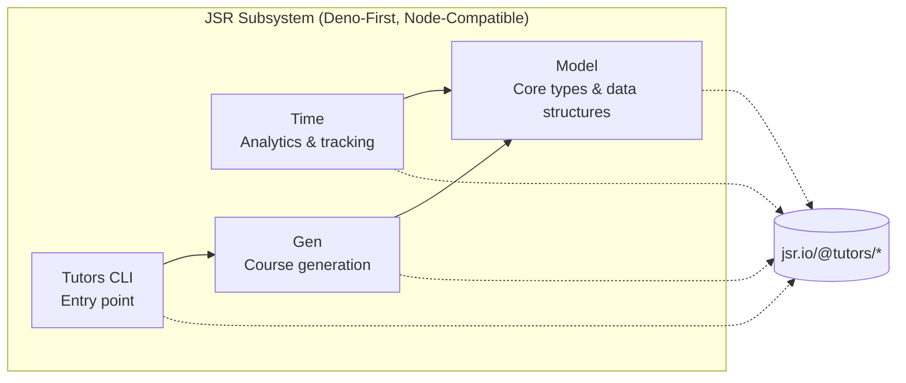

## Content Generation Pipeline

How content authored as markdown is transformed into a deployable course, consumed by the Reader application.

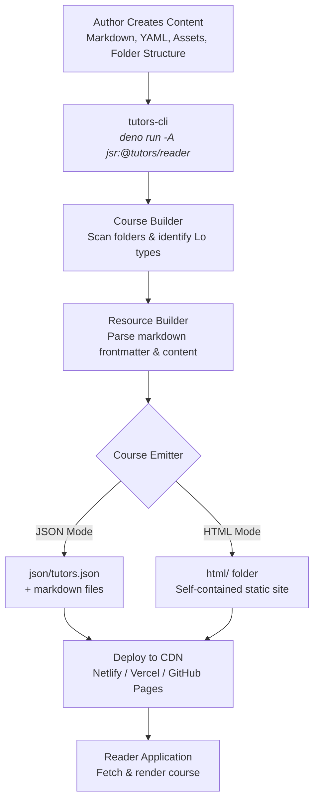

## Svelte Package Ecosystem

The Svelte packages are organised in layers, with each layer building on the one below.

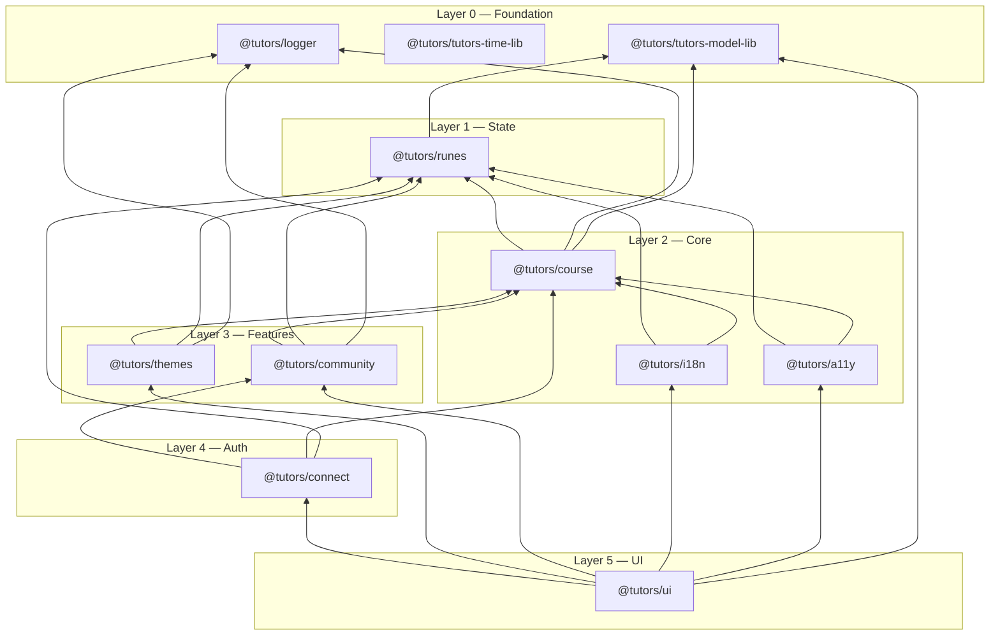

## Dependency Graph

Full package dependency hierarchy from applications down to the foundation layer.

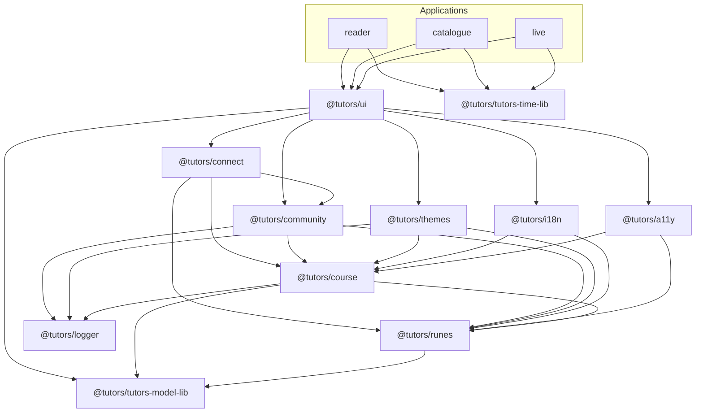

## Reader Application Flow

The sequence of events when a user navigates to a course in the Reader application.

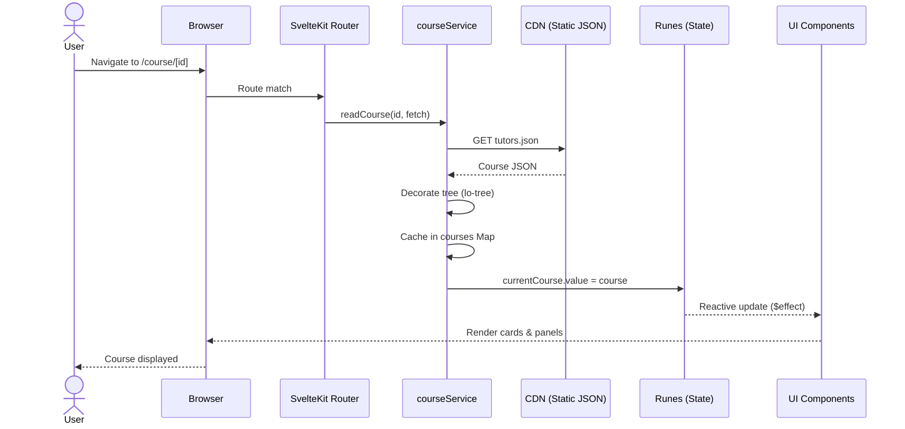

## Lab Viewing Sequence

How a lab is loaded, rendered step-by-step, and navigated by the learner.

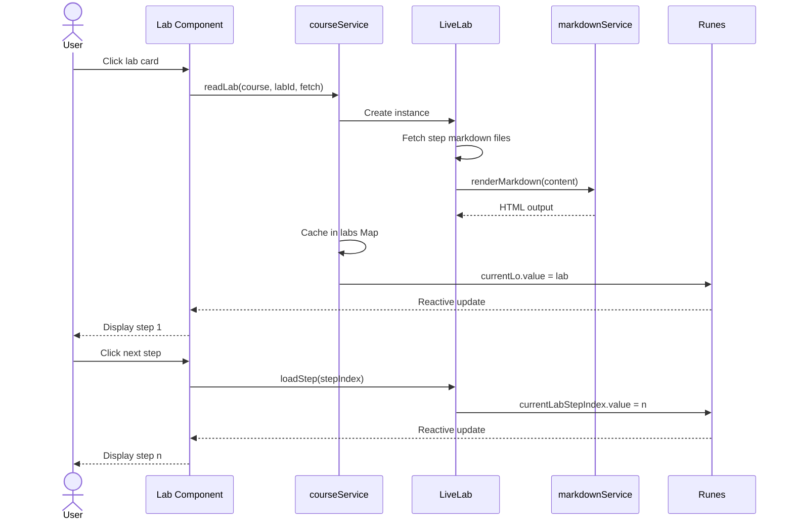

## Data Sources & State Management

The Reader application draws data from four sources: static JSON on a CDN, Supabase for analytics, PartyKit for real-time presence, and Auth.js for authentication.

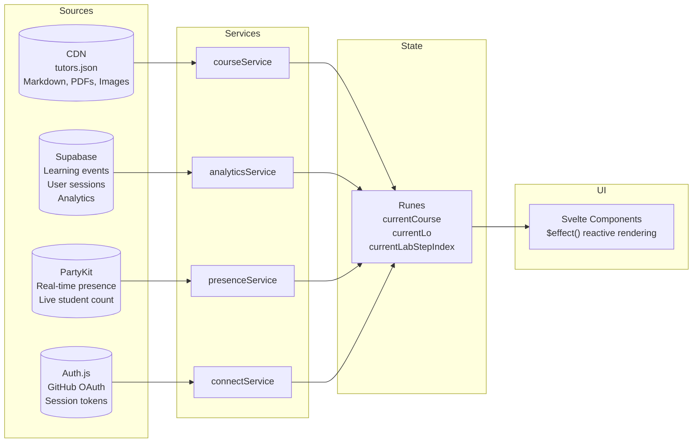

## PartyKit Real-Time Service

Room-based WebSocket broadcasting — one room per course — enabling live student presence across the platform.

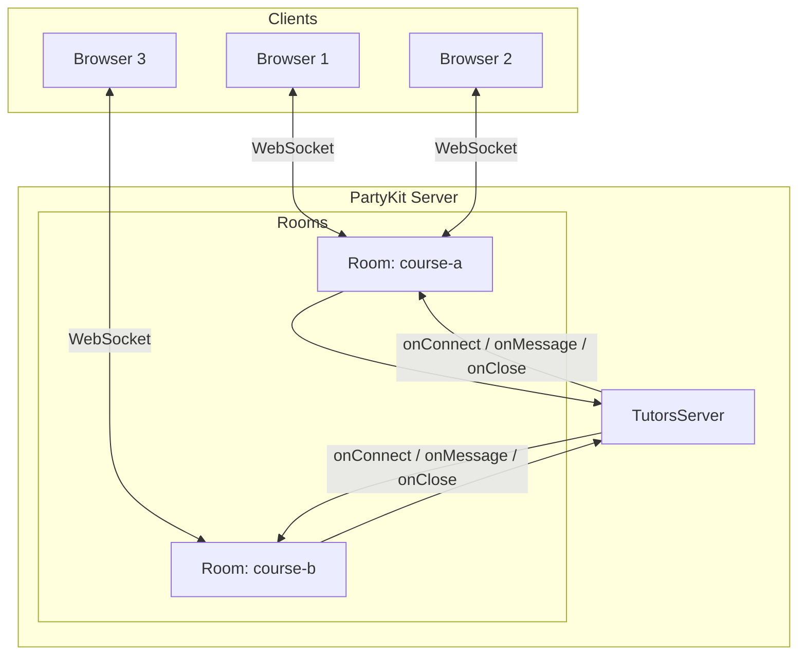

## UI Component Architecture

The UI package organises components into four categories: generic components, learning object components (content, layout, structure), navigators, and time/analytics views.

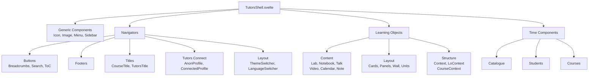

## Technology Stack

The major technologies used across the platform.

```mermaid
mindmap
  root((Tutors Platform))
    Build & Package
      pnpm 8+
      Vite 8
      TypeScript 5
    Runtimes
      Deno
      Node.js 18+
      Browser
    Frontend
      Svelte 5
      SvelteKit 2
      Tailwind CSS 4
      Skeleton UI 5
    Content
      markdown-it
      Shiki
      Marp
      Mermaid
      PDF.js
    Backend
      Supabase
      PartyKit
      Auth.js
